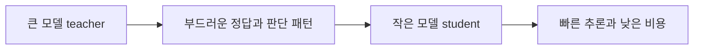

# 지식 증류 가이드

지식 증류(Knowledge Distillation)는 큰 모델의 판단 방식을 작은 모델로 옮기는 학습 전략이다. 핵심은 정답을 맞히는 능력만 복사하는 것이 아니라, teacher가 문제를 어떻게 보고 무엇을 비슷하다고 느끼는지까지 student에게 전달하는 데 있다. 그래서 지식 증류는 모델 압축이면서 동시에 학습 설계 문제다.

처음에는 앙상블이나 대형 모델을 더 작은 모델로 압축하려는 목적이 강했지만, 지금은 CNN, Transformer, LLM까지 이어지는 넓은 프레임워크가 되었다. 전달 대상은 보통 `response-based`, `feature-based`, `relation-based` 세 축으로 정리하고, 학습 방식은 offline, online, self distillation처럼 여러 갈래로 나뉜다.

이 도식의 요점은 student가 teacher의 가중치를 베끼는 것이 아니라, teacher의 판단 기준을 배우는 데 있다. 그래서 지식 증류는 경량화 기법으로만 이해하면 부족하고, 어떤 지식을 어떤 방식으로 옮길지 설계하는 문제로 이해해야 한다.

## 개념 지도
- [지식 증류란 무엇인가](docs/01-knowledge-distillation-is.md): teacher-student 구조, 앙상블 압축, 왜 이 문제가 생겼는지
- [왜 잘 작동하는가](docs/02-why-it-works.md): soft target, dark knowledge, temperature, 손실 조합
- [무엇을 전달하는가](docs/03-what-gets-transferred.md): response, feature, relation 기준과 attention이 어디에 놓이는지
- [지식 증류의 종류 정리](docs/types-of-knowledge-distillation.md): 전달 대상, 학습 구도, teacher 구성, 적용 상황 기준의 전체 분류
- [어떻게 학습하는가](docs/04-how-training-works.md): offline, online, self distillation, teacher assistant
- [실제로 어디에 쓰이는가](docs/05-real-world-use-cases.md): 모바일, 서버 비용, 실시간 응답, 제품화
- [LLM 시대의 지식 증류](docs/06-llm-distillation.md): white-box, black-box, response distillation, 법적 제약
- [한계와 오해, FAQ](docs/07-limitations-misconceptions-faq.md): capacity gap, teacher 오류 전파, pruning과 quantization과의 관계

## 보조 문서
- [용어집](docs/glossary.md): 핵심 용어의 짧은 정의
- [핵심 논문 타임라인](docs/paper-timeline.md): 연구 흐름의 큰 축
- [참고 자료](docs/references.md): 서베이와 대표 논문 링크
