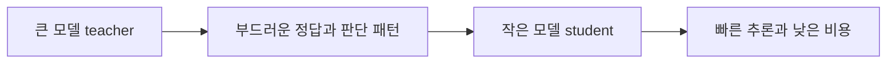

# 지식 증류 가이드

비전공자도 이해할 수 있는, 연구 근거 기반 Knowledge Distillation 안내서입니다.

## 이 저장소는 무엇을 다루나
- 큰 모델이 작은 모델을 어떻게 가르치는지
- soft target, dark knowledge, temperature가 왜 중요한지
- offline, online, self distillation이 어떻게 다른지
- CNN, Transformer, LLM에서 지식 증류가 어떻게 쓰이는지
- 대표 논문이 각각 어떤 역할을 했는지

## 누구를 위한 저장소인가
- 지식 증류를 처음 접하는 학생과 개발자
- 모델을 더 가볍고 빠르게 배포하고 싶은 사람
- 논문을 읽기 전에 큰 그림부터 잡고 싶은 사람
- LLM 소형화와 온디바이스 AI가 왜 중요한지 궁금한 사람

## 1분 요약
1. 지식 증류는 큰 모델인 teacher가 작은 모델인 student를 가르치는 학습 방식입니다.
2. 핵심은 정답 한 개만 전달하는 것이 아니라, 어떤 답이 얼마나 그럴듯한지도 함께 전달하는 데 있습니다.
3. 그래서 student는 더 작고 빠르면서도 teacher의 판단 패턴 일부를 배울 수 있습니다.
4. 이 아이디어는 모델 압축에서 출발했지만, 지금은 Transformer 압축과 LLM 소형화까지 넓게 이어집니다.

이 그림의 핵심은 단순한 정답 복사가 아니라, teacher의 판단 습관을 student가 배우는 과정이라는 점입니다. 그래서 지식 증류는 모델 압축이면서 동시에 학습 전략입니다.

## 추천 읽기 순서
1. [01. 지식 증류란 무엇인가](docs/01-knowledge-distillation-is.md)
2. [02. 왜 잘 작동하는가](docs/02-why-it-works.md)
3. [03. 무엇을 전달하는가](docs/03-what-gets-transferred.md)
4. [04. 어떻게 학습하는가](docs/04-how-training-works.md)
5. [05. 실제로 어디에 쓰이는가](docs/05-real-world-use-cases.md)
6. [06. LLM 시대의 지식 증류](docs/06-llm-distillation.md)
7. [07. 한계와 오해, FAQ](docs/07-limitations-misconceptions-faq.md)
8. [참고 자료](docs/references.md)

## 문서 구성
- `01`은 지식 증류의 출발점과 teacher-student 개념을 설명합니다.
- `02`는 soft target, dark knowledge, temperature를 직관적으로 풉니다.
- `03`은 출력, 특징, attention, 관계처럼 무엇을 옮길 수 있는지 정리합니다.
- `04`는 offline, online, self, teacher assistant 방식을 비교합니다.
- `05`는 모바일, 서버 비용, 비전과 NLP 사례를 통해 활용 맥락을 보여줍니다.
- `06`은 LLM distillation의 white-box와 black-box 흐름을 설명합니다.
- `07`은 큰 teacher가 항상 좋은 것은 아니라는 점을 포함해 흔한 오해를 정리합니다.

## 참고 자료 정책
이 저장소는 특정 블로그를 따라 쓴 문서가 아닙니다. 대표 원논문과 서베이를 바탕으로 내용을 다시 구성했습니다.
- 개념 축: Hinton 2015, FitNets, Attention Transfer
- 학습 축: Deep Mutual Learning, Born Again Networks, Teacher Assistant, Self Distillation
- NLP와 LLM 축: DistilBERT, TinyBERT, MiniLM, 2024 LLM survey, 2025 comprehensive survey

세부 출처와 추천 읽을거리는 [참고 자료](docs/references.md)에 정리했습니다.

## 라이선스
이 저장소의 문서는 [CC BY 4.0](LICENSE) 기준으로 공유합니다.
