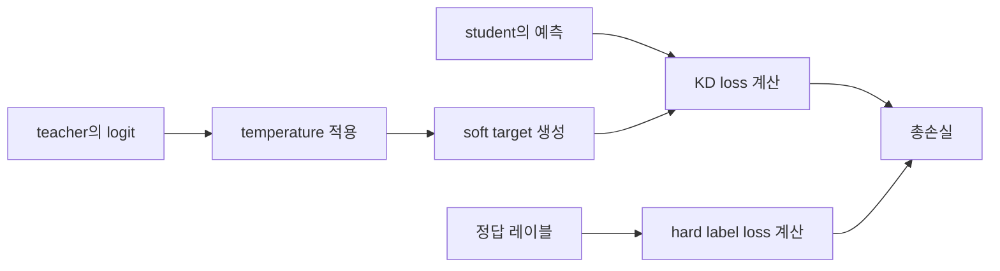

# 02. 왜 잘 작동하는가

지식 증류가 효과적인 이유는 정답 하나보다 훨씬 많은 정보를 teacher가 student에게 전달할 수 있기 때문이다. 일반적인 지도학습은 맞는 답 하나를 알려 주지만, teacher의 출력 분포는 어떤 답들이 서로 비슷하고 어떤 클래스가 헷갈리는지까지 보여 준다. student는 바로 이 추가 정보를 통해 더 부드럽고 구조적인 학습을 한다.

이를 동물 사진 분류에 비유하면 더 직관적이다. 정답이 고양이라고만 알려 주는 것과, 고양이일 가능성이 높지만 여우와 개와도 조금 비슷하다고 알려 주는 것은 다르다. 후자는 왜 이 문제가 쉬운지, 혹은 왜 헷갈리는지를 함께 알려 준다. 지식 증류에서 teacher는 이런 입체적인 힌트를 student에게 준다.

## 핵심 설명
보통 지도학습에서는 hard label을 사용한다. 정답 클래스 하나만 강하게 주어진다. 하지만 teacher는 각 클래스에 대한 확률 분포를 낼 수 있다. 이 분포를 soft target이라고 부른다. soft target에는 정답 외 클래스들에 대한 상대적 정보가 담겨 있다.

이 추가 정보가 흔히 dark knowledge라고 불린다. 예를 들어 고양이 사진에 대해 teacher가 여우를 두 번째 후보로 높게 보는 것은, 이미지 안에 털, 얼굴형, 눈 모양 같은 특징이 여우와도 닮아 있다는 뜻일 수 있다. student는 정답만 맞히는 것이 아니라, teacher가 본 유사도 구조까지 함께 배운다.

temperature는 이 분포를 더 잘 드러내기 위한 장치다. temperature가 커지면 분포가 더 부드러워져서 정답 외 클래스들의 차이가 더 눈에 들어온다. 반대로 temperature가 너무 낮으면 정답 클래스만 거의 1이 되고 나머지는 0에 가까워져, teacher가 알고 있는 미묘한 구분 정보가 가려질 수 있다.

실제 학습에서는 보통 두 손실을 함께 쓴다. 하나는 정답을 맞추는 손실이고, 다른 하나는 teacher의 분포를 따라가는 증류 손실이다. 그래서 student는 정답도 맞춰야 하고, 동시에 teacher처럼 생각하도록 유도된다.

```text
p_i^(T) = exp(z_i^teacher / T) / Σ_j exp(z_j^teacher / T)
q_i^(T) = exp(z_i^student / T) / Σ_j exp(z_j^student / T)
L_total = α * L_hard + β * T^2 * L_KD
```

여기서 중요한 것은 수식 자체보다 의미다. `p^(T)`와 `q^(T)`는 temperature가 적용된 teacher와 student의 확률 분포를 뜻하고, 고전적 KD에서는 `L_KD`를 이 두 분포 사이의 cross-entropy 또는 KL divergence로 두는 경우가 많다. 구현마다 표기는 조금 다르지만, hard loss와 함께 쓸 때 `T^2`를 곱하는 형태가 널리 쓰인다. 지식 증류는 teacher의 분포를 따라가는 학습과 정답을 맞추는 학습을 동시에 수행한다.



이 흐름을 보면 지식 증류는 teacher 분포를 따라가는 손실과 정답 손실을 함께 사용한다. 그래서 student는 단순한 분류기보다 더 구조적인 판단을 배울 수 있다.

## hard label과 soft target 비교

| 항목 | hard label 중심 학습 | soft target 중심 학습 |
| --- | --- | --- |
| 주는 정보 | 정답 하나 | 클래스 간 상대적 가능성 |
| 학습 신호 | 날카롭고 이산적 | 부드럽고 구조적 |
| 배우는 것 | 맞고 틀림 | 무엇이 비슷하고 왜 헷갈리는지 |
| 장점 | 단순하고 직접적 | 더 풍부한 일반화 신호 제공 |
| 한계 | 정답 외 정보가 거의 없음 | teacher 품질에 영향을 받음 |

이 표는 지식 증류가 왜 단순한 지도학습보다 더 많은 정보를 제공하는지 보여 준다. 핵심은 soft target이 정답 바깥의 구조를 담고 있다는 점이다.

## 심화 박스
Hinton 2015는 temperature를 이용해 teacher의 분포를 더 부드럽게 만들고, 그 분포를 student가 따르도록 하는 고전적 방식을 정리했다. 이후 DistilBERT 같은 작업은 여기에 추가 손실을 더해, 단순한 확률 모방을 넘어 표현 공간의 성질까지 보존하려고 했다.

즉 현대의 지식 증류는 soft target만 복사하는 단계에서 멈추지 않는다. 출력 분포, 중간 표현, attention 구조 등을 함께 옮기며 더 강한 student를 만드는 방향으로 발전했다.

## 자주 생기는 오해
- soft target은 확률을 예쁘게 만드는 장식이 아니다. 클래스 간 유사도 정보를 담는 중요한 신호다.
- temperature가 크다고 무조건 좋은 것은 아니다. 너무 크면 분포가 지나치게 평평해져 정보가 흐려질 수 있다.
- 지식 증류는 정답 손실을 버리는 방식이 아니다. 대부분의 경우 정답 손실과 함께 사용한다.

## 더 읽기
- [무엇을 전달하는가](03-what-gets-transferred.md)
- [어떻게 학습하는가](04-how-training-works.md)
- [용어집](glossary.md)
