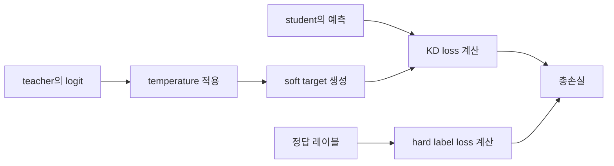

# 02. 왜 잘 작동하는가

## 한 줄 요약
지식 증류가 잘 작동하는 이유는 정답 한 개보다 훨씬 더 많은 정보를 teacher가 student에게 전달하기 때문입니다.

## 쉬운 비유
동물이 나오는 시험에서 정답이 고양이라고만 알려 주는 것과, 고양이일 가능성은 매우 높지만 여우와 개와도 조금 비슷하다고 알려 주는 것은 다릅니다. 후자의 설명은 문제를 더 입체적으로 이해하게 만듭니다. 지식 증류에서 teacher는 이런 입체적인 힌트를 student에게 줍니다.

## 핵심 설명
일반적인 지도학습에서는 정답 레이블이 하나만 주어집니다. 예를 들어 고양이 사진이면 정답은 고양이입니다. 하지만 teacher 모델은 이 사진을 보며 고양이일 가능성이 가장 높고, 여우일 가능성도 아주 조금 있고, 개일 가능성도 더 낮다고 판단할 수 있습니다. 이런 확률 분포에는 정답 하나로는 담기지 않는 정보가 들어 있습니다.

이 정보를 흔히 soft target이라고 부릅니다. 반대로 정답 레이블 하나만을 강하게 주는 방식은 hard label이라고 볼 수 있습니다. soft target은 어떤 클래스들이 서로 헷갈리기 쉬운지, teacher가 무엇을 비슷하게 보는지를 드러냅니다. 그래서 student는 단순히 맞고 틀림만 배우는 것이 아니라, 문제의 구조를 더 부드럽게 배웁니다.

여기서 자주 등장하는 개념이 dark knowledge입니다. 이것은 정답이 아닌 클래스들에 숨어 있는 상대적인 정보라고 이해하면 됩니다. 예를 들어 사진이 고양이일 때 teacher가 여우를 두 번째 후보로 높게 보는 것은, 이 이미지가 가진 털, 얼굴형, 눈 모양 같은 특징이 여우와도 닮아 있다는 뜻일 수 있습니다. student는 바로 이런 관계를 함께 배웁니다.

soft target을 더 잘 드러내기 위해 temperature라는 값을 사용하기도 합니다. temperature가 커지면 확률 분포가 더 부드러워져서, 정답 외 클래스들의 차이가 더 눈에 들어옵니다. 너무 날카로운 분포에서는 정답 클래스만 거의 1에 가깝고 나머지는 0에 가까워서, teacher가 알고 있는 미묘한 구분 정보가 잘 드러나지 않습니다.

실제 학습에서는 보통 두 가지 손실을 함께 씁니다. 하나는 정답 레이블을 맞추는 손실이고, 다른 하나는 teacher의 분포를 따라가는 증류 손실입니다.

```text
q_i = exp(z_i / T) / Σ_j exp(z_j / T)
L_total = α * L_hard + β * L_KD
```

여기서 중요한 점은 공식 그 자체보다 의미입니다. student는 정답도 맞춰야 하고, 동시에 teacher처럼 생각하도록 유도됩니다. 그래서 지식 증류는 단순한 지도학습보다 더 풍부한 학습 신호를 제공합니다.



이 흐름을 보면 지식 증류는 teacher의 분포를 따라가는 학습과 정답을 맞추는 학습을 같이 수행합니다. 그래서 student는 더 안정적인 방향으로 학습될 수 있습니다.

## 심화 박스
Hinton 2015는 temperature를 이용해 teacher의 분포를 더 부드럽게 만들고, 그 분포를 student가 따르도록 하는 고전적 방식을 정리했습니다. 이후 DistilBERT 같은 작업은 여기에 추가 손실을 더해, 단순한 확률 모방을 넘어 표현 공간의 성질까지 보존하려고 했습니다.

즉 현대의 지식 증류는 soft target만 복사하는 단계에서 멈추지 않습니다. 출력 분포, 중간 표현, attention 구조 등을 함께 옮기며 더 강한 student를 만드는 방향으로 발전했습니다.

## 자주 생기는 오해
- soft target은 확률을 예쁘게 만드는 장식이 아닙니다. 클래스 간 유사도 정보를 담는 중요한 신호입니다.
- temperature가 크다고 무조건 좋은 것은 아닙니다. 너무 크면 분포가 지나치게 평평해져 정보가 흐려질 수 있습니다.
- 지식 증류는 정답 손실을 버리는 방식이 아닙니다. 대부분의 경우 정답 손실과 함께 사용합니다.

## 더 읽기
- [03. 무엇을 전달하는가](03-what-gets-transferred.md)
- [04. 어떻게 학습하는가](04-how-training-works.md)
- [참고 자료](references.md)
