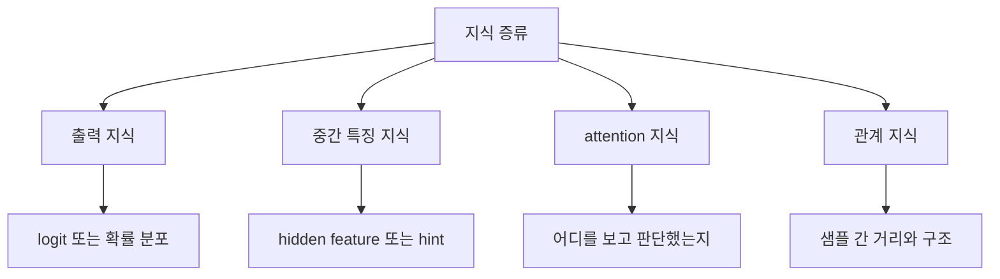

# 03. 무엇을 전달하는가

지식 증류는 최종 답만 옮기는 기술이 아니다. 연구가 진행되면서 무엇을 전달할 수 있는지의 범위가 넓어졌다. 지금은 출력 분포뿐 아니라 중간 특징, attention, 샘플 사이의 관계까지 증류 대상이 될 수 있다. 결국 질문은 하나다. teacher의 어떤 부분을 student에게 옮기면 가장 도움이 되는가.

## 쉬운 비유
요리를 가르친다고 생각해 보자. 완성된 음식만 보여 주는 것도 가능하지만, 반죽 질감, 불 조절 시점, 어디를 먼저 봐야 하는지까지 알려 주면 훨씬 잘 배운다. 지식 증류도 마찬가지다. 무엇을 전달하느냐에 따라 student가 배우는 수준이 달라진다.

## 핵심 설명
초기 지식 증류는 teacher의 최종 출력 분포를 student가 따라 하게 만드는 방식이 중심이었다. 구현이 단순하고 적용 범위가 넓기 때문이다. 하지만 최종 출력만으로는 teacher가 왜 그렇게 판단했는지 충분히 전달되지 않는 경우가 많다. 그래서 연구는 점점 더 내부 구조로 이동했다.

출력 지식은 teacher의 logit이나 확률 분포를 student가 닮도록 만드는 방식이다. 장점은 구현이 비교적 단순하고 다양한 모델에 적용하기 쉽다는 점이다. 반면 teacher의 내부 판단 과정을 충분히 담지 못할 수 있다.

중간 특징 지식은 teacher 내부 특정 층의 표현을 student가 맞추도록 유도한다. FitNets는 이 흐름을 대표한다. teacher가 중간 단계에서 어떤 특징을 추출하는지 student가 닮도록 만들면, 더 얇거나 더 작은 모델도 좋은 표현을 배울 수 있다.

attention 지식은 모델이 어디를 보고 판단하는지를 전달한다. 이미지라면 어떤 영역을 중요하게 보는지, Transformer라면 어떤 토큰 쌍을 강하게 연결하는지가 여기에 포함된다. Attention Transfer나 MiniLM 계열은 이 방향이 매우 강력할 수 있음을 보여 주었다.

관계 지식은 개별 샘플 하나보다, 여러 샘플이 표현 공간에서 어떤 구조를 이루는지를 보존하는 데 초점을 둔다. 예를 들어 고양이끼리는 가깝고 자동차와는 멀어야 한다는 식의 관계를 student가 배운다. 이 방식은 표현 공간 자체를 teacher답게 만들고 싶을 때 유용하다.

## 전달 대상 비교

| 전달 대상 | 무엇을 맞추는가 | 대표 아이디어 | 유리한 상황 |
| --- | --- | --- | --- |
| 출력 지식 | logit, 확률 분포 | Hinton 2015 | 단순하고 범용적인 KD가 필요할 때 |
| 중간 특징 | hidden feature, hint | FitNets | 작은 모델이 더 좋은 표현을 배워야 할 때 |
| attention | 주목 맵, self-attention 구조 | Attention Transfer, MiniLM | 모델의 판단 초점을 보존하고 싶을 때 |
| 관계 지식 | 샘플 간 거리, 구조, 유사도 | relation-based KD 계열 | 표현 공간 구조를 유지하고 싶을 때 |

실무에서는 이 네 가지를 하나만 쓰지 않고 조합하는 경우가 많다. 예를 들어 출력 분포를 맞추면서 동시에 feature나 attention도 맞춘다. 다만 많이 넣는다고 항상 좋은 것은 아니다. student의 용량과 계산 자원을 고려해 어떤 지식을 우선할지 정해야 한다.

## 심화 박스
FitNets는 student가 teacher의 중간 표현을 따라 하게 만드는 hint 기반 증류를 대표한다. Attention Transfer는 모델이 어디를 보고 판단하는지를 직접 맞추려는 시도다. MiniLM은 Transformer의 핵심 구조인 self-attention을 깊게 모방함으로써, 단순한 출력 모방보다 더 효율적인 압축이 가능하다는 점을 보여 주었다.

즉 지식 증류의 발전사는 무엇을 전달할 것인가에 대한 질문이 점점 더 정교해진 역사라고 볼 수 있다. 정답만 전달하던 단계에서, 판단 과정의 구조 자체를 옮기는 방향으로 확장된 것이다.

## 자주 생기는 오해
- 지식 증류는 항상 확률 분포만 따라 하는 것이라는 생각은 틀리다. feature, attention, relation도 모두 증류 대상이 될 수 있다.
- attention 증류는 Transformer에서만 가능한 것이 아니다. CNN에서도 주목 맵을 이용한 방식이 존재한다.
- 더 많은 신호를 옮긴다고 무조건 좋은 것은 아니다. 너무 많은 손실을 동시에 쓰면 student 학습이 오히려 어려워질 수 있다.

## 더 읽기
- [어떻게 학습하는가](04-how-training-works.md)
- [실제로 어디에 쓰이는가](05-real-world-use-cases.md)
- [핵심 논문 타임라인](paper-timeline.md)
