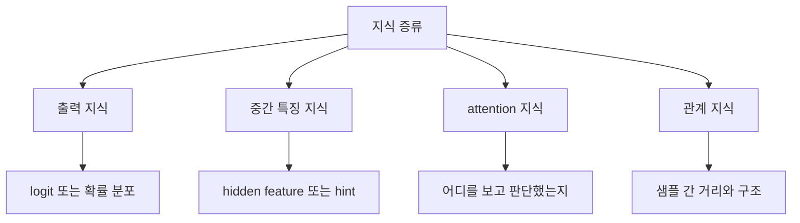

# 03. 무엇을 전달하는가

## 한 줄 요약
지식 증류는 최종 답만 전달하는 것이 아니라, 중간 특징과 attention, 샘플 사이의 관계까지 옮길 수 있습니다.

## 쉬운 비유
요리를 가르친다고 생각해 보겠습니다. 완성된 음식 사진만 보여 주는 것도 한 방법이지만, 반죽이 어느 정도 질감이어야 하는지, 어느 순간에 불을 줄여야 하는지, 어디를 먼저 봐야 하는지까지 알려 주면 훨씬 잘 배웁니다. 지식 증류도 비슷합니다. 무엇을 전달하느냐에 따라 student가 배우는 수준이 달라집니다.

## 핵심 설명
초기 지식 증류는 주로 teacher의 최종 출력 분포를 student가 따라 하게 만드는 방식이었습니다. 하지만 연구가 진행되면서, 모델의 최종 답만 따라 하는 것으로는 충분하지 않은 경우가 많다는 점이 드러났습니다. 그래서 지금은 여러 종류의 지식을 옮기는 방식이 연구됩니다.

첫째는 출력 지식입니다. 가장 널리 알려진 방식이며, teacher의 logit이나 확률 분포를 student가 따라 하게 만듭니다. 이 방식의 장점은 구현이 비교적 단순하고 다양한 모델에 적용하기 쉽다는 점입니다. 다만 teacher가 왜 그렇게 판단했는지는 충분히 전달되지 않을 수 있습니다.

둘째는 중간 특징 지식입니다. 모델 내부의 특정 층에서 나오는 feature를 맞추도록 유도하는 방식입니다. FitNets는 바로 이런 관점을 대표합니다. teacher가 중간 단계에서 어떤 특징을 추출하는지 student가 닮도록 만들면, 더 작거나 더 얇은 모델도 좋은 표현을 배울 수 있습니다.

셋째는 attention 지식입니다. 이것은 모델이 입력의 어느 부분에 집중하는지를 전달하는 방식입니다. 이미지라면 어떤 영역을 중요하게 보는지, Transformer라면 어떤 토큰 쌍에 주의를 두는지와 연결됩니다. Attention Transfer나 MiniLM 계열 연구는 이 방향이 매우 강력할 수 있음을 보여 주었습니다.

넷째는 관계 지식입니다. 이 경우 개별 샘플 하나의 정답보다, 여러 샘플이 표현 공간에서 어떤 구조를 이루는지 보존하는 데 초점을 둡니다. 예를 들어 고양이 이미지들끼리는 가까이 있고, 고양이와 자동차 이미지는 멀리 있어야 한다는 식의 관계를 student가 배우는 것입니다. 이 방식은 표현 공간 자체를 더 teacher답게 만들고 싶을 때 유용합니다.

실무에서는 한 가지 방식만 쓰지 않고 여러 종류의 지식을 함께 쓰는 경우도 많습니다. 출력 분포를 맞추면서 동시에 attention이나 feature도 맞추는 식입니다. 어떤 지식을 옮겨야 하는지는 teacher와 student의 구조, 태스크의 성격, 계산 자원에 따라 달라집니다.

## 심화 박스
FitNets는 student가 teacher의 중간 표현을 따라 하게 만드는 hint 기반 증류를 대표합니다. Attention Transfer는 모델이 어디를 보고 판단하는지를 직접 맞추려는 시도입니다. MiniLM은 Transformer의 핵심 구조인 self-attention을 깊게 모방함으로써, 단순한 출력 모방보다 더 효율적인 압축이 가능하다는 점을 보여 주었습니다.

즉 지식 증류의 발전사는 무엇을 전달할 것인가에 대한 질문이 점점 더 정교해진 역사라고 볼 수 있습니다. 정답만 전달하던 단계에서, 이제는 판단 과정의 구조 자체를 옮기는 방향으로 확장된 것입니다.

## 자주 생기는 오해
- 지식 증류는 항상 확률 분포만 따라 하는 것이라는 생각은 틀립니다. feature, attention, relation도 모두 증류 대상이 될 수 있습니다.
- attention 증류는 Transformer에서만 가능한 것이 아닙니다. CNN에서도 주목 맵을 이용한 방식이 존재합니다.
- 더 많은 신호를 옮긴다고 무조건 좋은 것은 아닙니다. 너무 많은 손실을 동시에 쓰면 student 학습이 오히려 어려워질 수 있습니다.

## 더 읽기
- [04. 어떻게 학습하는가](04-how-training-works.md)
- [05. 실제로 어디에 쓰이는가](05-real-world-use-cases.md)
- [참고 자료](references.md)
