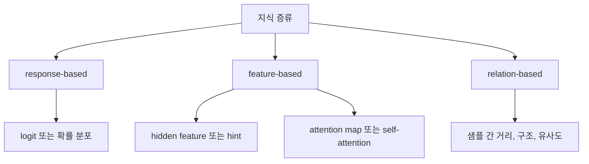

# 03. 무엇을 전달하는가

지식 증류는 최종 답만 옮기는 기술이 아니다. 최근에는 전달 대상을 크게 `response-based`, `feature-based`, `relation-based`로 정리하는 것이 가장 널리 쓰인다. attention은 설명 편의를 위해 별도 항목처럼 자주 등장하지만, 큰 틀에서는 feature-based 또는 구조 보존 계열의 대표적인 하위 방식으로 다루는 편이 많다.

요리를 가르친다고 생각해 보면 이해가 쉽다. 완성된 음식만 보여 주는 것도 가능하지만, 반죽 질감과 불 조절 시점, 어디를 먼저 봐야 하는지까지 알려 주면 훨씬 잘 배운다. 지식 증류도 마찬가지다. 무엇을 전달하느냐에 따라 student가 배우는 수준이 달라진다.

## 핵심 설명
초기 지식 증류는 teacher의 최종 출력 분포를 student가 따라 하게 만드는 방식이 중심이었다. 구현이 단순하고 적용 범위가 넓기 때문이다. 하지만 최종 출력만으로는 teacher가 왜 그렇게 판단했는지 충분히 전달되지 않는 경우가 많다. 그래서 연구는 점점 더 내부 표현과 구조로 이동했다.

### response-based distillation
teacher의 최종 출력, logit, 확률 분포를 student가 따라 하게 만드는 방식이다. 가장 고전적이고 범용적인 형태다. Hinton 2015가 대표적인 출발점이다.

### feature-based distillation
teacher의 중간 표현이나 hidden feature를 student가 닮도록 유도하는 방식이다. FitNets가 대표적이다. attention transfer나 self-attention distillation도 큰 틀에서는 이 범주 또는 구조 보존 계열 안에서 이해하는 경우가 많다. 즉 student가 teacher의 내부 표현 방식을 더 직접적으로 따라 배우게 만드는 접근이다.

### relation-based distillation
개별 샘플 하나의 출력보다, 샘플들 사이의 거리나 구조, 유사성 관계를 student가 보존하게 만드는 방식이다. 표현 공간의 구조를 teacher와 비슷하게 만들고 싶을 때 유용하다.

## 전달 대상 비교

| 전달 대상 | 무엇을 맞추는가 | 대표 아이디어 | 유리한 상황 |
| --- | --- | --- | --- |
| response-based | logit, 확률 분포 | Hinton 2015 | 단순하고 범용적인 KD가 필요할 때 |
| feature-based | hidden feature, hint, attention map, self-attention | FitNets, Attention Transfer, MiniLM | 내부 표현과 판단 초점을 더 직접적으로 옮기고 싶을 때 |
| relation-based | 샘플 간 거리, 구조, 유사도 | relation-based KD 계열 | 표현 공간 구조를 유지하고 싶을 때 |

실무에서는 이 세 가지를 하나만 쓰지 않고 조합하는 경우가 많다. 예를 들어 출력 분포를 맞추면서 동시에 feature나 attention도 맞춘다. 다만 많이 넣는다고 항상 좋은 것은 아니다. student의 용량과 계산 자원을 고려해 어떤 지식을 우선할지 정해야 한다.

## attention은 어디에 놓이는가
attention은 직관적으로 이해하기 쉬워서 종종 독립 분류처럼 소개된다. 하지만 최근 분류 중심 서베이에서는 보통 teacher의 내부 표현이나 구조를 옮기는 feature-based 계열 안에서 설명하거나, 더 넓게는 structure-preserving 신호의 한 형태로 다룬다.

이 저장소에서는 분류 체계를 단순하게 유지하기 위해 상위 기준을 `response-based`, `feature-based`, `relation-based`로 통일한다. attention은 그 안에서 특히 중요해서 별도 예시로 강조하는 하위 방식으로 취급한다.

## 심화 박스
FitNets는 student가 teacher의 중간 표현을 따라 하게 만드는 hint 기반 증류를 대표한다. Attention Transfer는 모델이 어디를 보고 판단하는지를 직접 맞추려는 시도다. MiniLM은 Transformer의 핵심 구조인 self-attention을 깊게 모방함으로써, 단순한 출력 모방보다 더 효율적인 압축이 가능하다는 점을 보여 주었다.

즉 지식 증류의 발전사는 무엇을 전달할 것인가에 대한 질문이 점점 더 정교해진 역사라고 볼 수 있다. 정답만 전달하던 단계에서, 판단 과정의 구조 자체를 옮기는 방향으로 확장된 것이다.

## 자주 생기는 오해
- 지식 증류는 항상 확률 분포만 따라 하는 것이라는 생각은 틀리다. feature와 relation도 모두 증류 대상이 될 수 있다.
- attention이 자주 따로 소개된다고 해서, 항상 상위 분류로 따로 떼어야 하는 것은 아니다. 많은 경우 feature-based 계열 안에서 이해하는 편이 더 일관적이다.
- 더 많은 신호를 옮긴다고 무조건 좋은 것은 아니다. 너무 많은 손실을 동시에 쓰면 student 학습이 오히려 어려워질 수 있다.

## 더 읽기
- [어떻게 학습하는가](04-how-training-works.md)
- [지식 증류의 종류 정리](types-of-knowledge-distillation.md)
- [핵심 논문 타임라인](paper-timeline.md)
