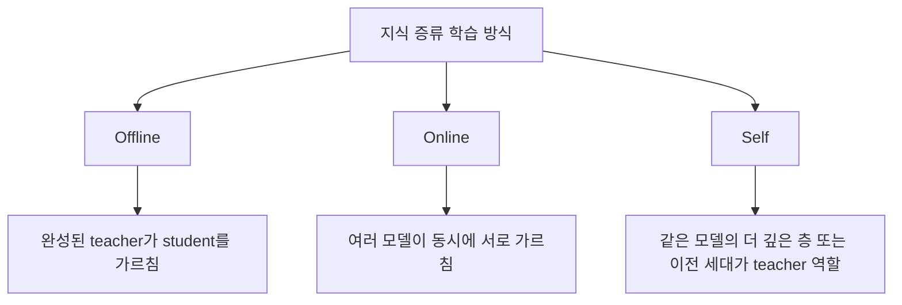
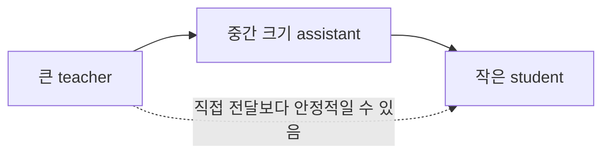

# 04. 어떻게 학습하는가

## 한 줄 요약
지식 증류는 teacher를 언제 준비하느냐, 누가 누구를 가르치느냐에 따라 offline, online, self distillation 같은 여러 방식으로 나뉩니다.

## 쉬운 비유
학원을 생각해 보면 이해하기 쉽습니다. 이미 완성된 스타 강사가 학생을 가르치면 offline 방식에 가깝습니다. 친구들끼리 서로 설명하며 함께 실력이 오르면 online 방식입니다. 스스로 요약 노트를 만들고 자기 자신을 다시 가르치면 self distillation에 가깝습니다.

## 핵심 설명
가장 전통적인 방식은 offline distillation입니다. 이 경우 먼저 큰 teacher를 충분히 학습시켜 둡니다. 그 다음 teacher의 출력을 고정한 상태에서 student를 학습합니다. 구조가 단순하고 안정적이어서 가장 널리 쓰입니다.

online distillation은 미리 완성된 teacher가 꼭 필요하지 않습니다. 여러 모델이 동시에 학습하면서 서로의 예측을 참고해 함께 좋아지는 방식입니다. Deep Mutual Learning은 이 흐름의 대표 사례입니다. 이 방식은 거대한 teacher가 없더라도 상호작용 자체가 학습 신호가 될 수 있음을 보여 주었습니다.

self distillation은 이름 그대로 모델이 자기 자신에게서 배우는 방식입니다. 하나의 네트워크 안에서 더 깊은 층의 정보를 얕은 층에 전달하거나, 이전 세대 모델이 다음 세대 모델을 가르치는 식으로 구현됩니다. Born Again Networks와 Be Your Own Teacher는 지식 증류가 꼭 큰 teacher와 작은 student의 구도만을 뜻하지 않는다는 점을 잘 보여 줍니다.

또 하나 중요한 주제는 teacher와 student의 크기 차이입니다. 상식적으로는 teacher가 크면 클수록 좋을 것 같지만, 실제로는 teacher와 student 사이의 차이가 너무 크면 지식이 잘 전달되지 않을 수 있습니다. 그래서 Teacher Assistant 방식은 중간 크기의 모델을 한 단계 넣어, 큰 teacher의 지식을 바로 작은 student에 주입하는 대신 여러 단계로 나누어 전달합니다.

이 다이어그램은 큰 teacher에서 아주 작은 student로 곧바로 가는 것이 항상 최선이 아니라는 점을 보여 줍니다. 때로는 중간 다리가 있어야 student가 더 잘 배웁니다.

실제로 어떤 방식을 고를지는 상황에 따라 다릅니다. 이미 강한 teacher가 있고 student를 빠르게 만들고 싶다면 offline이 좋습니다. 여러 모델을 함께 학습시키며 성능을 끌어올리고 싶다면 online이 유리할 수 있습니다. 추가 teacher 없이 자기 구조를 개선하고 싶다면 self distillation이 실용적입니다.

## 심화 박스
Deep Mutual Learning은 사전에 고정된 거대 teacher 없이도 서로 가르치는 구조가 강력할 수 있다는 점을 보여 준 대표 연구입니다. Born Again Networks는 심지어 같은 크기의 student가 teacher보다 더 좋아질 수 있음을 보여 주었습니다. Be Your Own Teacher는 하나의 네트워크 내부 구조를 이용한 self distillation을 보여 주었고, Teacher Assistant는 너무 큰 teacher가 항상 최적은 아니라는 현실적 문제를 해결했습니다.

이 흐름을 보면 지식 증류는 하나의 알고리즘 이름이 아니라, teacher와 student 사이의 지식 전달 설계를 어떻게 하느냐에 대한 넓은 프레임워크라고 이해하는 편이 맞습니다.

## 자주 생기는 오해
- offline distillation만이 정석이라는 생각은 틀립니다. online과 self 방식도 충분히 중요한 연구 축입니다.
- online distillation에는 반드시 미리 학습된 큰 teacher가 필요한 것은 아닙니다.
- teacher가 클수록 항상 student 성능이 올라가는 것은 아닙니다. capacity gap이 너무 크면 오히려 전달이 어려워질 수 있습니다.

## 더 읽기
- [03. 무엇을 전달하는가](03-what-gets-transferred.md)
- [06. LLM 시대의 지식 증류](06-llm-distillation.md)
- [참고 자료](references.md)
