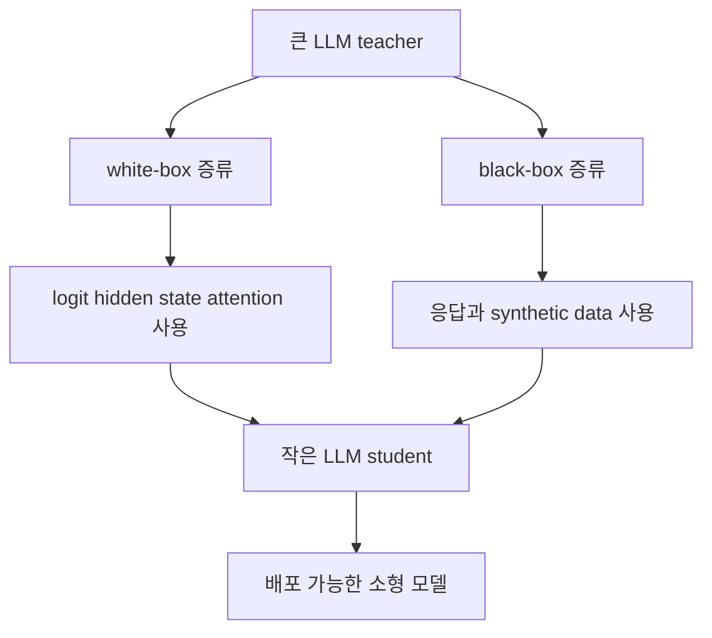

# 06. LLM 시대의 지식 증류

## 한 줄 요약
LLM 시대의 지식 증류는 거대한 언어 모델의 능력을 더 작고 배포 가능한 모델로 옮기기 위한 핵심 전략입니다.

## 쉬운 비유
유명 셰프에게 직접 주방 안에서 모든 조리 과정을 배울 수 있다면 white-box에 가깝습니다. 반대로 완성된 요리를 맛보고 레시피를 추론하며 배우는 것은 black-box에 가깝습니다. LLM distillation도 비슷합니다. teacher의 내부 정보를 볼 수 있느냐 없느냐에 따라 접근 방식이 달라집니다.

## 핵심 설명
LLM은 매우 강력하지만, 비용과 지연 시간이 큽니다. 큰 모델을 그대로 서비스에 넣으면 GPU 비용이 높고, 응답 속도도 느려질 수 있습니다. 그래서 많은 경우 작은 모델이 더 실용적입니다. 문제는 작은 모델이 원래는 큰 모델만큼 잘하지 못한다는 점입니다. LLM distillation은 이 간극을 줄이려는 시도입니다.

가장 단순한 관점에서 보면 LLM distillation도 기본 구조는 같습니다. 강한 teacher가 있고, 더 작은 student가 그 teacher의 출력을 닮도록 학습합니다. 다만 LLM에서는 teacher가 내놓는 출력이 단순한 클래스 확률이 아니라, 긴 문장 응답, 설명, 요약, 문제 풀이 과정, 지시 수행 결과일 수 있습니다. 그래서 학습 신호가 더 풍부하면서도 더 복잡합니다.

white-box distillation은 teacher의 내부 정보에 접근할 수 있을 때 가능합니다. 예를 들어 logit, hidden state, attention 같은 신호를 직접 student가 모방하도록 만들 수 있습니다. 오픈 모델이나 내부적으로 통제 가능한 모델 환경에서 주로 고려됩니다.

black-box distillation은 teacher의 내부를 볼 수 없을 때 사용합니다. 이 경우 teacher에게 다양한 질문을 던져 응답을 모으고, 그 응답으로 student를 학습시키는 방식이 흔합니다. instruction distillation이나 response distillation은 이 범주에 가깝습니다. 큰 모델이 만든 고품질 데이터셋을 teacher의 대리물처럼 사용하는 셈입니다.

LLM 환경에서는 데이터 생성도 매우 중요합니다. 작은 student는 원래 데이터만으로는 teacher 수준의 지시 수행 능력을 얻기 어렵기 때문에, teacher가 만든 요약, 질의응답, 설명, 리라이팅 결과가 학습 데이터로 쓰이기도 합니다. 이 때문에 LLM distillation은 단순한 모델 대 모델 전달이라기보다, teacher가 만든 데이터와 teacher의 행동 패턴을 student가 배우는 과정으로 이해하는 편이 맞습니다.

동시에 법적, 윤리적 주의점도 커집니다. teacher가 공개 모델인지, 상용 모델인지, 해당 출력물을 학습 데이터로 재사용해도 되는지, 서비스 약관을 위반하지 않는지 반드시 확인해야 합니다. LLM distillation은 기술 문제이기도 하지만, 라이선스와 데이터 거버넌스 문제이기도 합니다.

## 심화 박스
2024년 LLM 지식 증류 서베이는 알고리즘, 학습시키는 능력의 종류, 도메인 적용이라는 세 축으로 LLM distillation을 정리합니다. 2025년 comprehensive survey는 여기에 더해 foundation model, diffusion, multimodal, transformer 계열까지 포함한 더 넓은 분류 체계를 제시합니다.

즉 LLM distillation은 기존 지식 증류와 단절된 주제가 아니라, 기존 teacher-student 패러다임이 생성형 AI 환경으로 확장된 결과입니다. 차이는 출력이 길고 풍부해졌고, 데이터 생성 단계 자체가 증류의 일부가 되었다는 점입니다.

## 자주 생기는 오해
- LLM distillation은 단순히 작은 모델에 큰 모델 답변을 복붙하는 작업이 아닙니다. 어떤 데이터로 무엇을 옮길지 설계가 중요합니다.
- black-box distillation이 항상 열등한 것은 아닙니다. 내부 정보가 없어도 응답 품질이 높으면 충분히 강한 student를 만들 수 있습니다.
- 기술적으로 가능하다고 해서 항상 해도 되는 것은 아닙니다. 상용 teacher의 출력 재사용은 약관과 라이선스를 먼저 확인해야 합니다.

## 더 읽기
- [05. 실제로 어디에 쓰이는가](05-real-world-use-cases.md)
- [07. 한계와 오해, FAQ](07-limitations-misconceptions-faq.md)
- [참고 자료](references.md)
