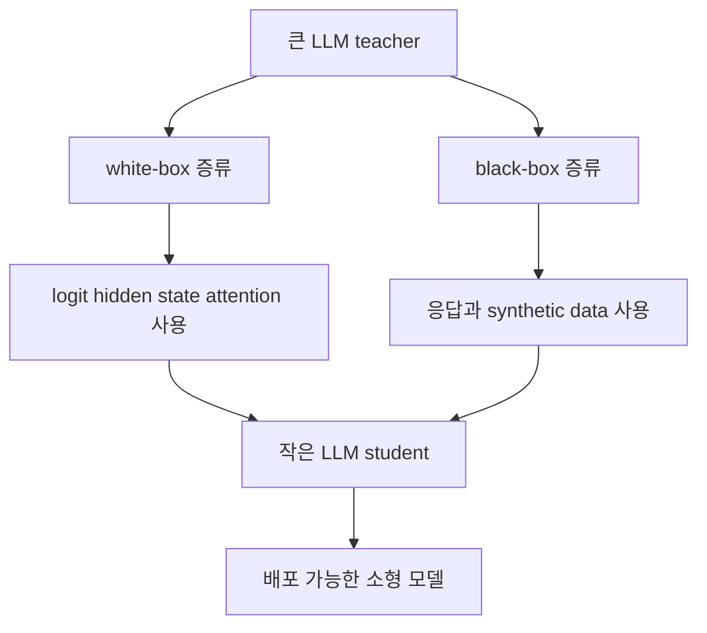

# 06. LLM 시대의 지식 증류

LLM 시대의 지식 증류는 거대한 언어 모델의 능력을 더 작고 배포 가능한 모델로 옮기기 위한 핵심 전략이다. 기본 철학은 기존 지식 증류와 같다. 강한 teacher가 있고, 더 작은 student가 teacher의 판단을 닮도록 학습한다. 하지만 LLM에서는 teacher의 출력이 단순한 클래스 분포가 아니라 긴 텍스트 응답, 설명, 추론 과정, 지시 수행 결과가 되기 때문에 상황이 훨씬 복잡해진다.

## 쉬운 비유
유명 셰프에게 직접 주방 안에서 조리 과정을 전부 볼 수 있다면 white-box에 가깝다. 반대로 완성된 요리를 맛보고 레시피를 추론하며 배우는 것은 black-box에 가깝다. LLM distillation도 비슷하다. teacher의 내부를 볼 수 있느냐 없느냐에 따라 접근 방식이 달라진다.

## 핵심 설명
LLM은 매우 강력하지만, 비용과 지연 시간이 크다. 큰 모델을 그대로 서비스에 넣으면 GPU 비용이 높고 응답 속도도 느려질 수 있다. 그래서 많은 경우 더 작은 모델이 필요하다. 문제는 작은 모델이 원래는 teacher만큼 잘하지 못한다는 점이다. LLM distillation은 이 간극을 줄이려는 시도다.

LLM 환경에서는 teacher의 출력이 곧 데이터가 되기도 한다. teacher에게 다양한 질문을 던져 응답을 모으고, 그 응답으로 student를 학습시키는 방식이 흔하다. instruction distillation이나 response distillation은 이 흐름에 가깝다. 즉 student는 teacher의 내부를 몰라도, teacher가 만들어 낸 고품질 응답 패턴을 학습할 수 있다.

teacher 내부 정보에 접근할 수 있다면 더 직접적인 증류도 가능하다. logit, hidden state, attention 같은 신호를 student가 직접 모방하게 만들 수 있기 때문이다. 이 방식은 white-box distillation에 가깝다. 반면 상용 API 기반 teacher처럼 내부 정보에 접근할 수 없는 경우에는 black-box distillation이 현실적이다.

이 도식은 LLM distillation이 크게 두 갈래로 나뉜다는 점을 보여 준다. 내부 접근이 가능하면 teacher의 구조적 정보를 직접 옮길 수 있고, 내부 접근이 불가능하면 응답 품질을 통해 간접적으로 지식을 옮긴다.

또한 LLM distillation에서는 데이터 생성이 매우 중요하다. 작은 student는 원래 데이터만으로는 teacher 수준의 지시 수행 능력을 얻기 어렵기 때문에, teacher가 만든 요약, 질의응답, 설명, 리라이팅 결과가 학습 데이터로 쓰이기도 한다. 그래서 LLM distillation은 모델 대 모델 전달인 동시에, teacher가 만든 데이터셋을 통한 전달이기도 하다.

## white-box와 black-box 비교

| 구분 | white-box distillation | black-box distillation |
| --- | --- | --- |
| teacher 접근 가능성 | 내부 정보 접근 가능 | 입력과 출력만 사용 가능 |
| 활용 신호 | logit, hidden state, attention | 응답, synthetic data, instruction 데이터 |
| 장점 | 더 직접적인 지식 전달 가능 | 상용 teacher나 폐쇄형 모델에도 적용 가능 |
| 약점 | 내부 접근이 필요함 | teacher 내부 구조를 직접 모방할 수 없음 |
| 대표 상황 | 오픈 모델, 내부 모델 스택 | API 기반 teacher, 서비스형 모델 |

이 표를 보면 LLM distillation은 단순한 기술 차이보다, teacher에 어떤 접근 권한이 있느냐에 따라 설계가 갈린다는 점이 드러난다.

## 실무에서 반드시 보는 체크리스트
- teacher의 출력물을 학습 데이터로 재사용해도 되는가
- teacher가 공개 모델인지, 상용 모델인지, 약관 제약은 없는가
- student가 실제 배포 환경에서 줄여야 하는 것은 latency인지 비용인지 메모리인지
- synthetic data의 품질을 누가 검수하고 어떻게 정제할 것인가
- teacher 응답의 편향과 오류가 student에게 얼마나 전파될 수 있는가

LLM distillation은 기술 문제이면서 동시에 라이선스와 데이터 거버넌스 문제다. 성능만 보고 진행하면 나중에 법적, 운영적 문제가 생길 수 있다.

## 심화 박스
2024년 LLM 지식 증류 서베이는 알고리즘, 학습시키는 능력의 종류, 도메인 적용이라는 세 축으로 LLM distillation을 정리한다. 2025년 comprehensive survey는 여기에 더해 foundation model, diffusion, multimodal, transformer 계열까지 포함한 더 넓은 분류 체계를 제시한다.

즉 LLM distillation은 기존 지식 증류와 단절된 주제가 아니다. teacher-student 패러다임이 생성형 AI 환경으로 확장된 결과다. 차이는 출력이 길고 풍부해졌고, 데이터 생성 단계 자체가 증류의 일부가 되었다는 점이다.

## 자주 생기는 오해
- LLM distillation은 단순히 작은 모델에 큰 모델 답변을 복붙하는 작업이 아니다. 어떤 데이터로 무엇을 옮길지 설계가 중요하다.
- black-box distillation이 항상 열등한 것은 아니다. 내부 정보가 없어도 응답 품질이 높으면 충분히 강한 student를 만들 수 있다.
- 기술적으로 가능하다고 해서 항상 해도 되는 것은 아니다. 상용 teacher의 출력 재사용은 약관과 라이선스를 먼저 확인해야 한다.

## 더 읽기
- [실제로 어디에 쓰이는가](05-real-world-use-cases.md)
- [한계와 오해, FAQ](07-limitations-misconceptions-faq.md)
- [핵심 논문 타임라인](paper-timeline.md)
