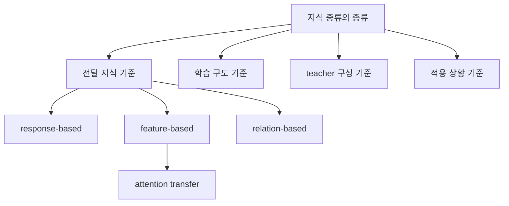

# 지식 증류의 종류 정리

지식 증류의 종류를 하나의 기준으로만 나누면 항상 일부가 빠진다. 어떤 논문은 `무엇을 전달하는가`를 기준으로 나누고, 어떤 논문은 `어떻게 학습하는가`를 기준으로 나누며, 또 어떤 논문은 `teacher를 몇 개 두는가`나 `데이터를 어떻게 확보하는가`를 기준으로 나눈다. 그래서 지식 증류를 제대로 이해하려면 한 줄 분류가 아니라 여러 축을 겹쳐서 봐야 한다.

최근 서베이들은 대체로 아래 네 축으로 정리하는 것이 가장 안정적이다.
- 어떤 지식을 전달하는가
- 어떤 학습 구도로 전달하는가
- teacher를 어떤 형태로 구성하는가
- 어떤 제약과 목적에서 사용하는가

이 저장소는 상위 전달 분류를 `response-based`, `feature-based`, `relation-based`로 통일한다. 다만 attention은 별도 범주로 소개하는 문헌도 있고, feature-based 또는 구조 보존 계열 안에 두는 문헌도 있다. 여기서는 설명 단순화를 위해 후자 쪽 정리를 따른다.

## 1. 전달하는 지식 기준의 분류
가장 널리 쓰이는 분류다. teacher의 무엇을 student가 따라 하게 만들 것인지에 따라 나눈다.

### response-based distillation
teacher의 최종 출력, logit, 확률 분포를 student가 따라 하게 만드는 방식이다. 가장 고전적이고 범용적인 형태다. Hinton 2015가 대표적인 출발점이다.

### feature-based distillation
teacher의 중간 표현이나 hidden feature를 student가 닮도록 유도하는 방식이다. FitNets가 대표적이다. attention map이나 self-attention을 맞추는 방식도 자주 이 축 또는 구조 보존 계열 안에서 설명하지만, 일부 문헌은 attention-based KD를 별도 범주로 강조한다.

### relation-based distillation
개별 샘플 하나의 출력보다, 샘플들 사이의 거리나 구조, 유사성 관계를 student가 보존하게 만드는 방식이다. 표현 공간의 구조를 teacher와 비슷하게 만들고 싶을 때 유용하다.

## 2. 학습 구도 기준의 분류
이 분류는 teacher가 언제 준비되고, 누가 누구를 가르치는지에 초점을 둔다.

| 종류 | 핵심 아이디어 | 대표 예시 |
| --- | --- | --- |
| offline distillation | 미리 학습된 teacher가 student를 가르침 | Hinton 2015 |
| online distillation | 여러 모델이 동시에 서로 가르침 | Deep Mutual Learning |
| self distillation | 모델이 자기 자신 또는 내부 구조에게서 배움 | Be Your Own Teacher |
| multi-step distillation | 중간 teacher assistant를 두고 단계적으로 전달 | Teacher Assistant |

offline distillation은 가장 전통적인 방식이다. 큰 teacher를 먼저 완성한 뒤 teacher를 고정하고 student를 학습한다. online distillation은 고정된 teacher 없이 여러 모델이 동시에 학습하면서 서로의 출력을 참고한다. self distillation은 teacher와 student를 완전히 다른 모델로 두지 않고, 하나의 모델 안에서 더 깊은 층이나 내부 보조 구조를 teacher처럼 활용한다. multi-step distillation은 teacher와 student의 차이가 너무 클 때 중간 크기 모델을 넣어 여러 단계로 전달한다.

Born Again Networks는 넓게는 self-distillation 문헌과 함께 언급되기도 하지만, 더 정확히는 같은 구조의 모델을 세대별로 반복 학습시키는 sequential KD 사례로 보는 편이 엄밀하다. 그래서 이 문서에서는 internal self-distillation의 대표 예시와 구분해 설명한다.

## 3. teacher 구성 기준의 분류
teacher를 몇 개 두느냐, 어떤 형태로 두느냐도 중요한 분류 축이다.

| 종류 | 설명 | 주로 쓰이는 이유 |
| --- | --- | --- |
| single-teacher | teacher 하나가 student를 가르침 | 가장 단순하고 기본적인 구조 |
| multi-teacher | 여러 teacher의 지식을 합쳐 student를 가르침 | 다양한 판단을 함께 반영하고 싶을 때 |
| teacher assistant | 큰 teacher와 작은 student 사이에 중간 teacher를 둠 | capacity gap 완화 |
| peer teaching | teacher와 student 구분이 약하고 모델들이 서로 배움 | online distillation, mutual learning |

single-teacher는 가장 기본적이다. multi-teacher는 서로 다른 강점을 가진 teacher 여러 개를 활용할 수 있지만 설계가 복잡해진다. teacher assistant는 전달 간극 문제를 완화하기 위한 실용적 전략이다. peer teaching은 고정된 상위 teacher 없이도 지식 전달이 가능함을 보여 준다.

## 4. 적용 상황 기준의 분류
최근 서베이에서는 알고리즘 구조뿐 아니라, 어떤 상황에서 쓰이는지도 별도의 분류 축으로 다룬다.

### cross-modal distillation
서로 다른 모달리티 사이에서 지식을 옮기는 방식이다. 예를 들어 더 풍부한 센서나 입력을 가진 teacher가 제한된 입력을 가진 student를 가르치는 경우다.

### data-free distillation
원래 학습 데이터를 직접 쓰기 어려운 환경에서, teacher와 생성된 샘플을 이용해 student를 학습시키는 방식이다. 개인정보나 데이터 접근 제약이 있을 때 중요하다.

### adversarial distillation
teacher와 student 사이의 차이를 줄이기 위해 adversarial learning 아이디어를 함께 쓰는 방식이다.

### task-specific distillation
분류, 검출, 분할, 번역, 질의응답처럼 특정 태스크에 맞게 손실과 전달 신호를 설계하는 방식이다.

### LLM distillation
생성형 응답, synthetic data, white-box와 black-box 제약, 약관 문제까지 함께 고려해야 하는 최근 확장 축이다.

## 5. 분류 축별 대표 매트릭스

| 분류 축 | 대표 하위 종류 | 대표 논문 예시 | 주로 답하려는 질문 |
| --- | --- | --- | --- |
| 전달 지식 | response-based, feature-based, relation-based | Hinton 2015, FitNets, Attention Transfer | teacher의 무엇을 student에게 옮길 것인가 |
| 학습 구도 | offline, online, self, multi-step | Hinton 2015, Deep Mutual Learning, Be Your Own Teacher, Teacher Assistant | teacher가 언제 어떤 방식으로 student를 가르치는가 |
| teacher 구성 | single, multi, assistant, peer | single-teacher KD, multi-teacher KD, Teacher Assistant | teacher를 몇 개 두고 어떻게 연결할 것인가 |
| 적용 상황 | cross-modal, data-free, adversarial, task-specific, LLM | data-free KD 계열, LLM KD survey | 어떤 제약과 목적에서 KD를 쓰는가 |

이 표를 보면 한 논문이 하나의 분류에만 속하지 않는다는 점이 드러난다. 예를 들어 어떤 연구는 feature-based이면서 offline일 수 있고, 또 동시에 teacher assistant 구조를 사용할 수도 있다.

## 이 분류가 왜 중요한가
지식 증류를 단순히 `큰 모델이 작은 모델을 가르친다`로만 이해하면, 실제 논문을 읽을 때 자꾸 분류가 뒤섞인다. 어떤 논문은 feature를 옮기고, 어떤 논문은 online 방식이며, 어떤 논문은 multi-teacher 구조일 수 있다. 즉 하나의 논문이 여러 분류 축 위에 동시에 놓일 수 있다.

그래서 지식 증류의 종류를 정리할 때는 하나의 정답 분류표를 찾기보다, 여러 분류 축을 겹쳐서 보는 편이 정확하다. 이것이 최근 서베이들이 공통적으로 취하는 접근이다.

## 연결 문서
- [무엇을 전달하는가](03-what-gets-transferred.md)
- [어떻게 학습하는가](04-how-training-works.md)
- [LLM 시대의 지식 증류](06-llm-distillation.md)
- [참고 자료](references.md)
